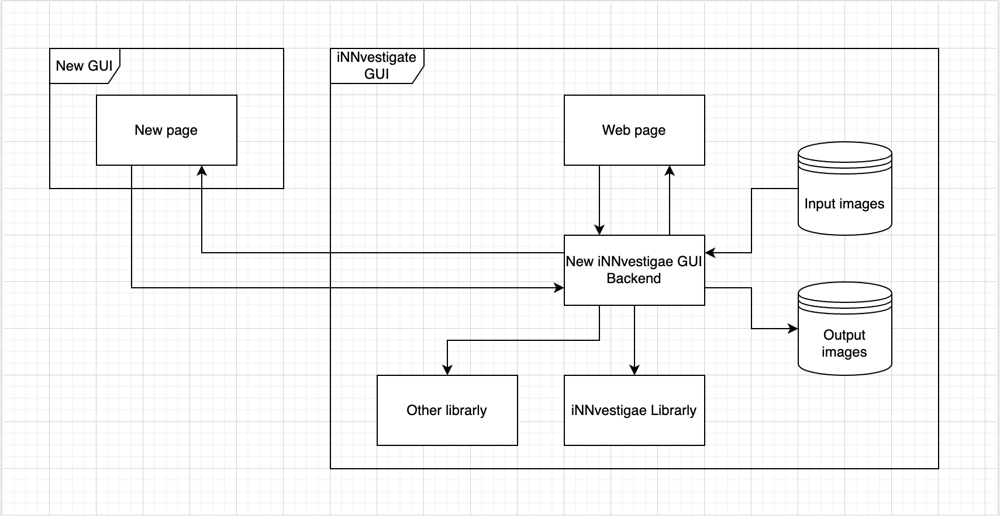

# iNNvestigate-application

This tool base on [iNNvestigate](https://github.com/albermax/innvestigate) and [iNNvestigate-GUI](https://gitlab.com/grains2/innvestigate-gui), which offer an out-of-the-box implementation of the key methods for displaying neural network activations in order to make a simple web application environment available on top of it, which is enhanced with a variety of strong tools, available.

The iNNvestigate-application is focused on compares the results of each visulization and enables users to organize a set of photographs and identify differences between them.

# Design
The backend of this application's RESTful API, in which the client and server communicate using the HTTP protocol, is the iNNvestigate-GUI. additionally utilizing [React](https://react.dev/) as the application's frontend   

# Getting Started
## Cloning project   
    git clone https://github.com/HuskyIsHere/innvestigate-application.git   

    cd innvestigate-application  
## Build Docker container
For build iNnvestiagte application first time using

    docker-compose up --build

If you already build an container

    docker-compose up
## Open innvestigate-application
Backend main port   

    http://localhost:8000/  

Frontend main port   

    http://localhost:3000/home

# Getting stop
## Stopping a docker container
    docker-compose down

## Clearing memory after delete container 
Note: This step using only when you want to delete an container and build new one please clearing up memory first

    docker builder prune --all
