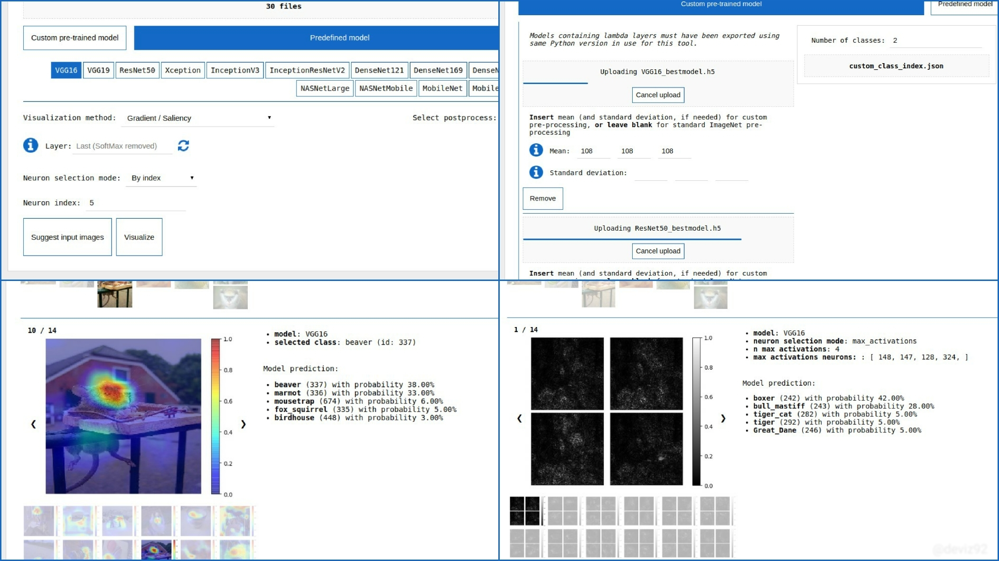
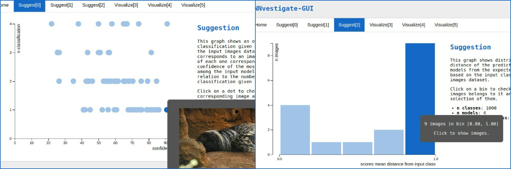

# iNNvestigate GUI

This tool is based on [iNNvestigate](https://github.com/albermax/innvestigate), which provide an out-of-the-box implementation of the main techniques for visualizing the activations of neural networks, in order to make available an easy-to-use web application environment on top of it, enriched with many other powerful instruments.

iNNvestigate-GUI is focused on Convolutional Neural Networks for classification problems, and it is divided in two main block, one dedicated to the visualization per se, while the other one is for providing suggestion of the input images that should be interesting to use for the visualization.

It can be used with custom pre-trained Keras models and with all the predefined Keras models.


## Requirements

The tool is compatible with all modern browsers, and it has been developed using [Python](https://www.python.org/) and [Flask](https://palletsprojects.com/p/flask/), with [Keras](https://keras.io/) + [Tensorflow](https://www.tensorflow.org/) as Deep Learning libraries.

If you're using a Linux-like system, you should be ready using the following commands:
```bash
sudo apt install build-essential git python3 python3-pip
git clone https://gitlab.com/grains2/innvestigate-gui.git

# in the cloned project directory (sudo is not needed if you use a python virtualenv)
sudo python3 setup.py install

# if every step of the installation goes well output should be something like: 
# 'Finished processing dependencies for innvestigate-gui==version.number'

export FLASK_APP=innvestigate-gui
flask run

# server should be up and running at 127.0.0.1:5000
```

For other information about how to set Flask to run the server in a remote machine, see [Flask documentation](https://flask.palletsprojects.com/en/1.1.x/).


## Visualization



This part is based on the implementations of the main techniques for visualizing activations made available by [iNNvestigate](https://github.com/albermax/innvestigate). In particular, all the funcionalities of iNNvestigate can be used in this tools, using the web application GUI.

Among the many visualization techniques developed by iNNvestigate, we do not include the DeepLIFT-wrapper implementation, because of some limits we encountered in using it (see [iNNvestigate web-page](https://github.com/albermax/innvestigate) to read more about this), while we add [GradCAM and Guided GradCAM](http://gradcam.cloudcv.org/) techniques.
For more information about the visualization techniques implemented by iNNvestigate, please visit [iNNvestigate web-page](https://github.com/albermax/innvestigate).

The visualization can be performed by using only one model in input, or more than one.

If only a model is provided, it is possible to select which layer to use for the visualization, no matter which technique has been selected, by inserting the layer name in an autocomplete field, loaded with the names of only the layers which can be used for the selected visualization method.

Some visualization techniques let the user to select the neuron inside a layer to be used for the visualization, and this is possible in iNNvestigate-GUI by specifying the index of the neuron inside a specified layer. Otherwise it is also possible to use the 1, 4, 9, 16 neurons corresponding to the max activations for the specified layer. In case more than a model is used in input, layer selection is no more valid and neuron selection can be performed only using the "max activations" way.

While there are some visualization techniques for which it can be interesting to select a specified neuron inside a layer to be used for the visualization, other visualization methods works considering the classes of the model, and in iNNvestigate-GUI this is possible no matter which layer has been selected, even if more than a model is used.


## Suggestion of input images

Working with large datasets, it can be very useful to have a tool that provides some statistics in order to properly suggest which input images can be worthy to analyze further. iNNvestigate-GUI provides this kind of help, providing 4 different kind of suggestions divided in 2 groups, whether there is only one model in input or more than one.



#### If only a model in input

After having loaded the proper input images' dataset, if the user choose to use only one model in input, the "Suggest input images" button can be pressed in order to receive suggestion only if a visualization method has been selected too. In fact, whit only one model in input, selecting a visualization method will let the user to insert a layer name and perform either a neuron selection or a class selection.

When the user select a visualization method that enable class selection, suggestion for input images can be provided by the tool relying only on a layer of the input model, the one specified by the user or, if user do not select any layer, the last layer by default. Instead, if the user select a visualization method that enable both layer and neuron selection, suggestion on input images can be received relying either on just the select layer (or the last one, as default) or, if specified, the selected neuron index.

In particular, the first kind of suggestion, based only on a layer, will produce an histogram that plots the distribution of the mean activations over the selected layer, among the images in the input dataset, while the second kind of suggestion, based on a specific neuron of a layer, will show an histogram that plots the distribution of the activations of the selected neuron, among the images in the input dataset. The histograms are both interactive and, by clicking on a bin, it is possible to see the images belonging to it, together with the information used to produce the graph.

Analyzing the graphs, user has a chance to identify interesting cases on which to further investigate, using the visualization methods provided by the tool.

#### If more than a model in input

In this case, it is possible to produce more sophisticated statistics than the ones of the previous case.

After having loaded the proper input images' dataset, if the user choose to use more than a model in input, clicking on "Suggest input images" button will open a modal when the user is prompted to insert the class to which the input images belong to, if the input dataset contains only images belonging to the same class. In this case, 2 graphs will be shown, while if the input images are heterogeneus, only one of the 2 graphs can be produced.

In particular, the first graph, that shows in both cases, is a scatterplot of all the input images represented as circles, whose position is based on the confidence of the classifications made by the input models related to the consistency of the classes in output to the different models. In this graphs, hovering a circle will let the user to see which is the correspondent input image and its filename, while clicking on a circle will show more information about the image.

If instead the user specify the class to which all the input images belong to, also an histogram is plotted, in order to show the distribution of the distances of the mean scores predicted by the input models from the input class as ground truth, among the images in the input dataset. By clicking on a bin, it is possible to see the images belongint to it, together with the information used to produce the graph.

Analyzing the graphs, user has a chance to identify interesting cases on which to further investigate, using the visualization methods provided by the tool.

